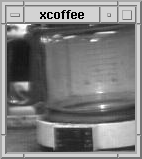
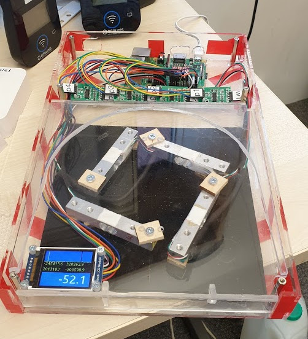

# Cambridge Coffee Pot

## Introduction

There is slightly more to this project than perhaps meets the eye. The motivation is to explore issues
likely to be highly relevant as we expand the 'urban sensor' activities from the regional SmartCambridge
initiative into the more detailed in-building sensing required in our partnership with the Centre for Digital
Built Britain. 

The Smart City agenda requires robust sensors deployed at scale across a large region and much
of the work is dominated by ingesting data from existing sources which provide relatively inflexible 
interfaces and poor support for real-time data collection and analysis. We may (and do) use neural-network
based image sensors in the region (see
[how we used them to measure the lockdown effect](https://www.cl.cam.ac.uk/~ijl20/cambridge_lockdown.html))
but from a 'sensor deployment' standpoint these real-world CNN/ML cameras have similar challenges to dumber 
sensors (like car park barriers) with less sophisticated internals.

The collaboration with the Centre for Digital Built Britain requires more innovation in the actual sensor
design and deployment, while also allowing us to design these from the ground up to provide data amenable
to real-time collection and analysis.

The *spatial* nature of sensor data (e.g. *where* was the CO2 sensor when it recorded an all-time high) is
always recorded but the *temporal* nature of the readings is traditionally given insufficient emphasis. In part this 
is because it is common for data to be collected in a given time period and analyzed retrospectively. Our intent
is to analyze the incoming data as it arrives in real-time including recognizing patterns, making predictions and 
taking actions.

So a detailed consideration of the temporal implications is required, and it is worth highlighting a small number
of key concepts (such as *time, timeliness, latency, real-time, event, readings, sensor fusion*):

*time*: there is one *time* fundamentally important for most sensor readings, that is the *time most 
suitable to be associated with the sensor reading*. For example, a sensor that is counting people it can see in
an image frame would most sensibly use the time the picture was taken. Note there are many different times the sensor
could send with their data (the time the object detection process completed, the time the data was sent from the
sensor, the time the receiving platform received the data) and we wish to collect most of these, but the sensor
reading time is *special* and we take special care of that (and normalize to a defined field called `acp_ts` to 
store the microsecond timestamp for that value). Most sensors neither know the time nor transmit it in their data,
assuming the receiving end will add a timestamp if it is interested. Some sensors simply transmit an erroneous
approximate time as if it is not important (e.g. time included in the common bus position transmitters
used in the UK, even though a GPS was obviously used to get the lat/lng).

*timeliness*: this is the human/physical timescale relevant to the thing being measured or the conclusions likely
to be drawn from an incremental reading. For example, a CO2 reading cannot be taken instantaneously, there is some
natural timescale over which the reading will be accumulated. On a more subtle point, traffic speed for a *highway*
is actually meaningless, the underlying data source is the movement of individual vehicles and it takes a certain
amount of time to decide a reasonable value. It even takes a certain amount of time for a car to enter a parking lot
so the timestamp of a 'car entry' event is somewhat subjective. On a more important point, a modern camera-based
sensor on a highway, in addition to reporting traffic loads and speeds may be able to recognize a car crash. The
temporal questions are fundamentally when in the complex sequence of event was it correct to report that a crash
had occurred (or was inevitable) and how long did it take the sensor to recognise and report it. The most complex
aspect of timeliness is the timescale over which appropriate action should be taken given the sensor reading, and
the events or spatiotemporal situation preceding it. For a (real) example on a highway, if a crash occurs blocking
every lane in one direction, what is a reasonable amount of time for the infrastructure to respond to mitigate the
impact on other road users? To set the benchmark here in late December 2019, after a similar crash I witnessed on
one of the UK's main highways, the delay before the complete closure of the highway was reported on Google Maps
was 8 minutes.

*latency*: this is simply the computer/network/programmer introduced delay between a sensor reading being valid and
that data appearing downstream in the system at the intented destination. There are two key issue here: (i) the
latency introduced by the *network* tends to get measured up the wazoo, even though in current systems this is often
the least of the issues. (ii) essentially *all* latency today is due to inadequate systems design, for example data
is typically collected and stored, and then polled at an acceptable frequency from those stored sources. This applies
as equally to real-world infrastructure in cities as with development systems in university research. To collect
data from a real building management system the starting point for negotiation will be once-every-24-hours, introducing
an immediate 86400-second latency into the data even though the readings might be on a 30-second granularity.

*real-time*: for us (and Investment Banking) this simply means asynchronous push protocols are used *throughout*
the system. This means the systems are typically low latency (latency can be any figure so long as it is consistent
with the required timeliness) but there are *not* artificially introduced delays (such as polling for a sensor reading
or updating a web page periodically). In consequence the processing tends to be event-driven, i.e. an individual sensor
reading can be the catalyst for an action such as closing a vent (or calling emergency services) even though the
decision is based on cumulative state built up over a number of sensor readings from multiple sources. Note we do not
use the term *real-time* to refer to the fact that each sensor reading simply has a *time*, reagrdless of how accurate or
otherwise that is. Sensor readings with timestamps can be stored in a time-series database and rendered in time/value plots,
but in our terminology that is a traditional request-response system, not a real-time platform.

*event* vs. *status reading*: Most sensors send their data on a regular period, e.g. once every 20 seconds (current bus position data
in the UK) or every 5 minutes (the car park occupancy figures we collect). It is possible to configure some sensors to
proactively send a reading immediately if set conditions are met (e.g. the basic reading has changed by a percentage) although
this is far from common. We refer to these periodic reports as *status readings*. The period used is typically decided by the
sensor programmer to make cost effective use of other infrastructure (such as energy, network or storage usage) rather than
being related to some physical constant (although some sensors, such as particulates, may be limited by the time it takes for
them to come up with a reliable measure). Note that sensor data systems build around a storage system are relatively insensitive
to the latency introduced by a fixed time period for the sensor readings and as a consequence tend to be less interested in the
possibilities introduced by low-latency proactive messages from the sensor. We refer to these proactive messages as *events* which
in the simplest case can be, for example, "electrical energy use readings have just increased above a defined threshold". However,
the significance of events becomes more apparent with a more intelligent sensor (or combination of sensors connected to a *node*),
for example "a highway crash is occurring".

*sensor fusion*: In our work, this is intelligently combining spatiotemporal data from multiple hetergeneous sensors such that
meaningful events can be *derived* from the incoming readings (and events) and communicated to the host plaform. In the case of the
Cambridge Coffee Pot, this crucially includes "I think we'll soon have a fresh pot of coffee".

## The Coffee Pot
Back in the day (1991) we had this coffee pot with a low-res monochrome camera connected to
a frame-grabber and a server in the Computer Laboratory, then in the Austin Building in central
Cambridge.  We could type the command ```xcoffee``` on our workstations and decide whether to make
the arduous trip around to the coffee machine or lurk in our offices until some worthy colleague had
made a fresh pot of coffee. When the world-wide-web first became a thing we connected the frame grabber
to a web server and were surprised how many people around the world wanted to see a 'webcam' (the word wasn't
yet invented) and the rest is history (see [Trojan Room coffee pot](https://en.wikipedia.org/wiki/Trojan_Room_coffee_pot)).

<p align="center">
    
</p>

Well, here we are ~30 years later in a somewhat shinier modern Computer Laboratory out at West Cambridge, but
the endemic coffee dependency remains a central theme, with our local kitchen looking like this (2019):


So the question is, should we have a **new** coffee sensor and if so what would it look like in 2019 vs 1991?


## The concept

Build a sensor set that measures and transmits in real-time the coffee-making
and consuming events happening on the Computer Lab Cambridge Coffee Pot.

This is actually monitoring the direct descendant of the original
Cambridge [Trojan Room coffee pot](https://en.wikipedia.org/wiki/Trojan_Room_coffee_pot)
from 1991 to 2001.


## Sample data

The sensor will take weight measurements as in the sample data illustrated below which was
collected using the first prototype.

The sensor will recognize events
such as a fresh pot of coffee being placed, a cup being taken, and the pot becoming empty.
 The objective is that these events are communicated
to the server with the minimum latency while the periodic reporting of the weight (e.g. once a
minute or so) is primarily a 'watchdog' message confirming the coffee pot is working.


The pot weighs ~0.5 Kg, and when full holds 2Kg of coffee. Each cup taken is ~0.25Kg.

It was unexpected that the press on the plunger to pour a cup of coffee could result in
combined downward weight >10Kg.

## Prototype

2019-10-09


Note in this first prototype I'm using a *single* hx711 to A/D convert both load cells, as
the hx711 has two channels (A & B) which are not equally accurate but both good enough for
our application. But when reading both A/D values on the Pi from channel A followed by channel B
a ~half second latency was required between the two readings as the hx711 is clearly multiplexing some
of its circuitry between the two channels.

### Version with 2 x 5Kg load cells and 2 A/D converters, with a prototype housing.

2019-10-04


In this image you can see I moved the two load cells onto two separate hx711 A/D converters
and used the A channel of each. This reduced the single read time of both sensors to a few milliseconds. The
A/D sample rate defined in the hx711's is defaulted to 10Hz (the alternative is 80Hz) so there is no point in
repeating readings within 100ms.

Here we hit an engineering problem. The weighing platform was reasonable stable 'fore and aft' i.e.
along the axis the pot is placed on the sensor (as was the intention and the mountings for the two
load cells were aligned this way). However, when the plunger is pressed
the tilting forces *from side to side* were larger than expected and the weighing platform felt too fragile
on that axis to survive long in production use. The considered solutions were some sliding pillar arrangement
to keep the weighing platform from rocking, or the use of four load cells. We went with the latter.

To keep the height of the housing as small as practicable the electronics are placed in a sealed separate area
adjacent to the load cells (as opposed to beneath them). This gives the overall housing the approximate plan
dimensions of an A4 sheet of paper. The 'landscape' arrangement of this sensor made poor use of the space available
in the kitchen so in the next version a 'portrait' arrangement was used.

### Next version with 4 x 5Kg load cells

2019-10-06



In addition to the four load cells, this prototype uses 4 x hx711 A/D converters to reduce latency in reading. Although
the HX711 A/D converter has two channels (A & B), there is a ~500ms latency switching beween the two channels. As
sensor latency is a central theme of this development four independent HX711 chips are used, each only using channel A.

### Adding the LCD display

2019-10-06

The 'portrait' arrangement conflicts with the simple solution of putting the LCD display to the left
or right of the load area, as was planned with the 'landscape' design.

The solution was to use transparent acrylic for the weighing platform and mount the LCD *under*
the front left corner of the weighing platform.

## Real-time events

Embedded in the coffee pot sensor are two load cells that measure the weight of the pot.

In the data-sensing business, everybody, and I mean everybody, assumes the sensor design is finished
after the first
few lines of code are written that actually manages to read the parameter being measured and send the results.
This is understandable as often they will have spent weeks or months just trying to get the measurement sensor
to actually work reliably.

The effect of this is you end up with a 'weight sensor' that either has a built in period for repeatedly
sending its reading, or it can be 'polled' by a server somewhere that periodically asks for its reading. Either
way you end up with a sensor that doesn't really care about the thing it's measuring, and neither does the server,
 so long as the data flow adheres to the once-a-minute (or whatever) regular schedule.

Maybe someone comes along and asks for the data with less system-related latency. The sensor / system developer
will always, and I mean always, respond with one of two answers: (1) you don't need the data more quickly,
or (2) shall I send the data twice as 'fast' (i.e. every 30 seconds).

The truth is the required 'timeliness' (or acceptable latency) of the reading depends considerably on the
state of the 'thing' being measured.  E.g. A traffic speed sensor on a highway that
sends the prevailing traffic speed once a minute is better than no sensor, but there
is no good reason it would send the readings "72,75,71,69,0" at
regular intervals. Hopefully that last reading of ZERO could be sent within a millisecond
of being measured, rather the possibly waiting 59 seconds
to send it as a regular update. And a design that simply sends the measured speeds *every* millisecond is pretty dumb.

This issue regarding the timeliness of sensor data is pervasive, particularly in urban and in-building sensor systems.

Our coffee pot will connect to our existing real-time Intelligent City Platform (which itself can process
incoming events without introducing system-related polling latencies) and will
* send the weight periodically, say once per five minutes - this is best thought of as a 'watchdog' which
happens to carry a useful payload.
* recognize the following events and transmit them to the platform as soon as they are recognized:
    * POT_REMOVED - the pot appears not to be present
    * POT_NEW - freshly made coffee seems to have appeared
    * POT_POURED - a cup was poured
    * POT_EMPTY - pot appears to contain no coffee
    * COFFEE_GROUND - by also monitoring coffee grinding machine (with a microphone), it seems coffee has been ground.

## Visualizing the data

This is an open question at the moment. The original coffee pot presented the data as a 128x128px monochrome
image and it was left to the viewer how to interpret it, combined with an implicit assumption the user would
issue the ```xcoffee``` command at the time they were interested in the coffee. Note the readings displayed
below are high-frequency (10x/sec) and noisy and annotated with the 'Events' recognized at the time). This data
can be contrasted with the 'server' view illustrated in the web client section below.


The proportion of erroneous readings is exaggerated by the chart, as normal readings provide a very high number
of overlapping 'dots' on the chart while the erroneous readings are isolated dots. The main reason for the 'noise'
is the simplistic ['bit-banging'](https://en.wikipedia.org/wiki/Bit_banging) approach used to read the HX711 weight sensor in Python
which might be improved with a better GPIO library (such as [pigpio](http://abyz.me.uk/rpi/pigpio/)).

The new design can assume the permanent connection of web-based displays (in addition to the 'user request'
model) and we will consider (i.e. measure) the latency in the system reporting a fresh pot of coffee.

It has been suggested that any self-respecting coffee machine in 2019 would have a Twitter account. [[ref]](#ref_1)

## Remote Sensors

This sensor is designed to be a **Sensor Node**. I.e. the Cambridge Coffee Pot contains multiple sensors and provides Events as
a result of interpreting input from all of them. In particular, the Cambridge Coffee Pot receives data from two modified energy-monitoring
smart plugs which inform the composite sensor node when the coffee is being ground, and when the coffee-making machine is boiling
the water.

The implementation of these sensors is described in the [remote sensors](remote_sensors/README.md) section.

## Development install

```
git clone https://github.com/ijl20/cambridge_coffee_pot
```

This repo includes working python libraries for:

* the hx711 D/A chip commonly used to connect load cells (code/hx711_ijl20/hx711.py)
* the st7735 LCD drive chip commonly used with inexpensive small LCD displays (code/st7735_ijl20/st7735.py)

The ```code``` directory contains a bunch of other libraries for the hx711 and the st7735 which were a reasonable source of clues but needed improvement.

Python support for http POST of sensor data:

```
pip install requests
```

## CPU

For this one-off experimental sensor we used a Raspberry Pi 3B+, using the GPIO pins to
connect the LCD display (via SPI) and the two load cell A/D converters (each needing +Vcc, GND and two data
pins)


## LCD Display - Waveshare 1.8inch color LCD module

We interact with this via the st7735_ijl20 library `code/st7735_ijl20/st7735.py`


[Online info](https://www.waveshare.com/wiki/1.8inch_LCD_Module)

E.g. [available Amazon UK](https://www.amazon.co.uk/Waveshare-1-8inch-LCD-Module/dp/B077YFTMVT)

[LCD Module Schematic (pdf)](LCD_1in8/1.8inch-LCD-Module-Schematic.pdf)

[LCD Module user manual (pdf)](LCD_1in8/1.8inch_LCD_Module_User_Manual_EN.pdf)

[ST7735 data sheet (pdf)](LCD_1in8/ST7735S_V1.1_20111121.pdf)

## Load cells for weight sensing the coffee pot

Two 5Kg load cells connected via two HX711 A/D converters.

We connect with the A/D converters via the `code/hx711_ijl20/hx711.py` library


E.g. [available Amazon UK](https://www.amazon.co.uk/gp/product/B07GRGT3C3)

[HX711 Data sheet](hx711/hx711_english.pdf)

## The web client

The Cambridge Intelligent City Platform is used to receive the real-time data (periodic weight readings and low-latency
events) from the sensor and also provide some user-appropriate display derived from this data. The information
sent to the Platform for a sample day is visualized below (the 'event' pattern matching in the
sensor is first-cut prototype):


At this scale the periodic weight readings look detailed but it is *important* to note these are sent on a
regular 2 minute interval and for real-time purposes provide a potential 2 minute latency to the actual
state of the sensor. 

In contrast the events (which include the current weight) are sent as soon
as the event pattern is recognized (e.g. within a second of a cup being poured). The key point is that
the 'events' latency is dominated by the characteristics of the behaviour being monitored 
rather than some artificial time constant (like a polling interval) embedded in the software.
For example a 'cup poured' event requires time to recognize
potentially multiple presses on the pot plunger as a single 'cup poured' event.

This web client uses the Intelligent City Platform [rtclient](https://github.com/ijl20/rtclient) as a starting 
framework.

Here's an image of the client during development 2019-12-13:


## References

<a id="ref_1">[1]</a> Heidi Howard, in conversation around the Coffee Pot, Cambridge Computer Lab, 2019-10-30
